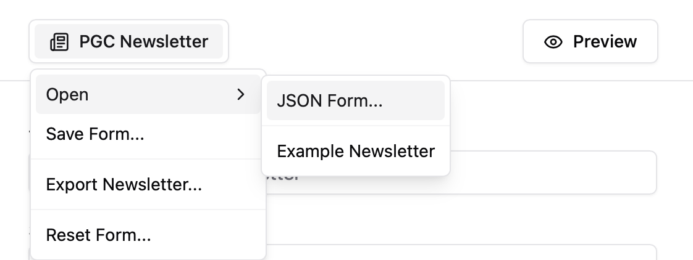

# PGC Newsletter

The PGC Newsletter is a regular email newsletter that highlights news and events for postgraduate students at the
University of New South Wales (UNSW). It was previously composed in Mailchimp (see: [April 2022](https://www.arc.unsw.edu.au/uploads/pgc-newsletter-2022-04.html))
before [MJML](https://github.com/mjmlio/mjml) was used to build later iterations (see: [May 2023](https://www.arc.unsw.edu.au/uploads/pgc-newsletter-2023-05_3.html)
and [June - July 2024](https://www.arc.unsw.edu.au/uploads/pgc-newsletter-2024-06-07.html)). This project provides a user-friendly
interface to edit the MJML template and preview the transpiled HTML newsletter. Check it
out: https://pgc-newsletter.vercel.app/

## Features

There are a few features built into the menu which can be accessed by clicking the `PGC Newsletter` button in the header:



Opening the `Example Newsletter` is a good way to see how things are structured once the form is filled out with content. If you want to start from scratch, click on `Reset Form`. Any changes you make to the form will automatically be reflected in the newsletter preview. On mobile, you can toggle between the form and preview sections by clicking on the `Preview` button in the header. 

Once you're happy with the way things look, you can click on `Export Newsletter` to save the newsletter as an HTML file. This file can be opened in a browser or copied into an email client.

I would also recommend using the `Save Form` feature to download your form content as a JSON file. This will allow you to continue editing the newsletter later by going to `Open > JSON Form`.

### Using the Form

There's no form validation (yet), so you could make a title 100 words long or leave fields completely empty. However, I would recommend sticking to the following guidelines:
- Title: ~ 5 words
- President's Message: ~ 100 words
- Description: ~ 25 words
- Date and time (for events): Choose and stick to a format (e.g. DD/MM, HH:MM AM/PM)
- Image URL: Link to a 16:9 image (e.g. 1920 x 1080)

The first Highlight Card can be "featured". This will make the card take up both columns on desktop (there's no effect on mobile). Naturally, this will draw some attention away from the other cards, so use it appropriately. Happy editing!

## Getting Started with Development

Run the project locally by following the usual steps:

1. Clone the repository:
   ```sh
   git clone https://github.com/tfle/pgc-newsletter.git
   cd pgc-newsletter
   ```
2. Install the dependencies:
   ```sh
   npm install
   ```
3. Start the development server:
   ```sh
   npm run dev
   ```

### Project Structure and Key Files

There are few key directories and files in which the majority of the working code lives. The `src`
directory contains the application code, including the three main components: `Header.tsx`, `Editor.tsx`, and `Preview.tsx`. The 
`createHighlightActions.ts` file contain functions for working with the Highlight cards in the Editor component and the
`generateMJML.ts` file contains the logic for stitching the MJML code together.

```plaintext
pgc-newsletter/
├── src/
│   ├── components/
│   │   ├── Header.tsx
│   │   ├── Editor.tsx
│   │   ├── Preview.tsx
│   │   └── ...
│   ├── App.tsx
│   ├── createHighlightActions.ts
│   ├── generateMJML.ts
│   └── ...
└── ...
```

## Roadmap

Ideas/tasks/features for the future:
- [ ] Use local storage for saving form content
- [ ] Form validation (required fields, character limits, URL validation)
- [ ] Image handling (uploading images, resizing images)
- [ ] Preview for desktop/mobile toggle
- [ ] Debounce form changes and preview updates
- [ ] Memoization for performance improvements
